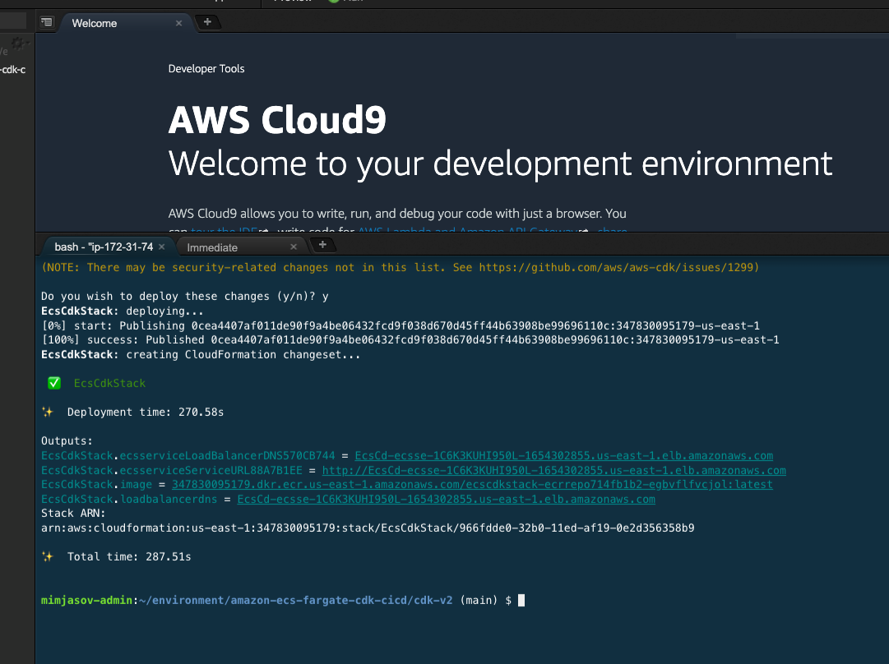
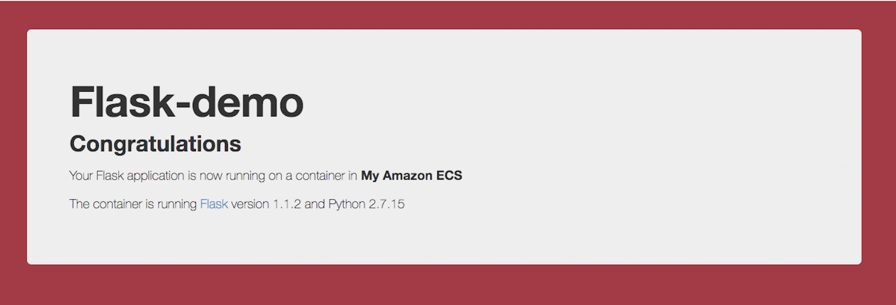
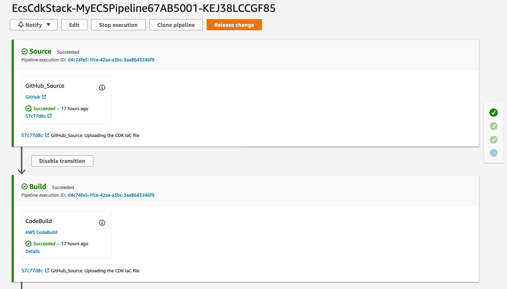
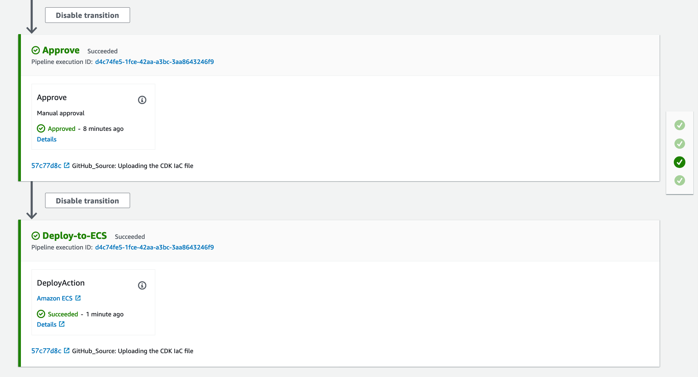

# Amazon CI/CD pipeline deploying to ECS Fargate using CDK V2
_A complete DevOps enabled sample containerized application_

This project builds a complete sample containerized Flask application publically available on AWS, using Fargate, ECS, CodeBuild, and CodePipline to produce a fully functional pipline to continuously roll out
changes to your new app.

## Getting Started

We recommend using [Cloud 9]() to get started, however you may also use your own
development machine. You will need to adjust the commands to install base
requirements like jq, npm, AWS CDK, AWS CLI, and Typescript.


### Setup Cloud9 Environment

Launch a `t2.micro` [Cloud9 us-east-1](https://us-east-1.console.aws.amazon.com/codesuite/codepipeline/pipelines) terminal and prepare it with following commands:

```bash
sudo yum install -y jq
export ACCOUNT_ID=$(aws sts get-caller-identity --output text --query Account)
export AWS_REGION=$(curl -s 169.254.169.254/latest/dynamic/instance-identity/document | jq -r '.region')
echo "export ACCOUNT_ID=${ACCOUNT_ID}" | tee -a ~/.bash_profile
echo "export AWS_REGION=${AWS_REGION}" | tee -a ~/.bash_profile
aws configure set default.region ${AWS_REGION}
aws configure get default.region
```

Ensure the Cloud9 instance is assigned a role of an administrator and from Cloud9 -> AWS Settings -> Credentials -> Disable the Temporary Credentials

Prepare CDK prerequisite:

```bash
sudo yum install -y npm
npm install -g aws-cdk
npm install -g typescript@latest
```

Then, make sure you have your AWS account configured. Run `aws configure` or
ensure the `AWS_ACCESS_KEY`, `AWS_SECRET_ACCESS_KEY`, and `AWS_SESSION_TOKEN`
environment variables are properly set.

### Configure the GitHub Repository and upload the application

Open https://github.com/aws-samples/amazon-ecs-fargate-cdk-v2-cicd.
Login to GitHub, and fork the repository into your account.

Access your Cloud9 environment and run the following command from the `~/environment` directory, replacing USER-NAME with your GitHub username. 

```bash
git clone https://github.com/USER-NAME/amazon-ecs-fargate-cdk-v2-cicd.git 
```

### Create a Secret for your GitHub Token

As a security best practice, never hard-code your GitHub token in the code. We will make use of AWS Secrets Manager service to store the GitHub Token and use the CDK APIs to access the token from our code.

#### Create a Personal access token in Github. 
Using the Github website, navigate to Settings/Developer Settings/Personal access tokens, create a new token with the following permissions:

* admin:repo_hook
* admin:org_hook
* repo

and don't close the window yet, you will need the token value in the next step.

#### Store token in AWS Secrets Manager

By default name for this secret is 
`/aws-samples/amazon-ecs-fargate-cdk-v2-cicd/github/personal_access_token`. 

To change the secret name, make the proper subsititions below,and then specify the optional `githubTokenSecretName` parameter during the [`cdk deploy step`](#launch-infrastructure-with-aws-cloud-developement-kit-cdk).

```bash
aws configure set region $AWS_REGION
aws secretsmanager create-secret \
 --name /aws-samples/amazon-ecs-fargate-cdk-v2-cicd/github/personal_access_token \
 --secret-string <GITHUB-TOKEN> 
```

Once the above command is run, check if the secret is stored as expected using below command:

```bash
aws secretsmanager get-secret-value \
 --secret-id /aws-samples/amazon-ecs-fargate-cdk-v2-cicd/github/personal_access_token \
 --version-stage AWSCURRENT
```

### Authorize CodeBuild

It is neccessary to authorize code build to create the hook in Github which will
trigger deployments through your Code Pipeline.
Replace <GITHUB-TOKEN> with your GitHub Personal Access Token in the following snippet and run the
following in you development environment.

```bash
aws codebuild import-source-credentials \
 --server-type GITHUB \
 --auth-type PERSONAL_ACCESS_TOKEN \
 --token <GITHUB-TOKEN> 
```

Verify the credential import worked.

```bash
aws codebuild list-source-credentials 
```

### Launch infrastructure with AWS Cloud Developement Kit (CDK)

Navigate to the `cdk-v2` directory and run the following commands:

```bash
cd cdk-v2
cdk init
npm install
npm run build
cdk ls
cdk bootstrap aws://$ACCOUNT_ID/$AWS_REGION
```


Next, you are ready to synthesize and deploy your application:

```bash
cdk synth
cdk deploy \
 --parameters githubUserName=<myGithubUserName>
```

You may be asked to confirm the creation of the roles and authorization before the CloudFormation is executed, for which, you can respond with a “Y”. The infrastructure will take approximately 5-10 minutes time to create, please wait until you see the output of CloudFormation printed on the terminal.

You may also control parameters for your deployment as follows:

```bash
cdk deploy \
 --parameters githubUserName=<myGithubUserName>\
 --parameters githubPersonalTokenSecretName="<myGithubPersonalTokenSecretName>" \
 --parameters datadogApiKey="<myDatadogApiKey>" \
 --context stackName="<myStackName>"
 ```

### Review Infrastructure and Application


When the CloudFormation deployment is complete fetch the URL from the CDK outputs. You can also see this in the AWS Web console.



Initially the app represents the base image which is defined here
and added to the ECS Task Definition
[./cdk-v2/lib/ecs_cdk-stack.ts](/cdk-v2/lib/ecs_cdk-stack.ts#L87):

```typescript
const container = taskDef.addContainer('flask-app', {
    image: ecs.ContainerImage.fromRegistry("public.ecr.aws/amazonlinux/amazonlinux:2022"),
    memoryLimitMiB: 256,
    cpu: 256,
    logging
});
```

This is why when first clicking on the app url you will see an error page.


Once the CodePipeline is triggered, CodeBuild will run the set of commands to dockerize 
the application found in the [./flask-docker-app](./flask-docker-app) folder and push it to an Amazon ECR repository. 
Before deploying it to the ECS infrastructue, it will ask you for manual approval to move to the next stage. 
Once approved, it will deploy the application into ECS platform, by creating the task definition, 
service and instantiating the tasks to the desired count. In our case, the default desired count is 1 and 
thus an instance of flask application will be accessible from Load Balancer as shown above.

The deployment on the ECS initially will take around 5 minutes to ensure the older application task 
is gracefully drained out and the new task is launched. You would see the ECS service reach a 
Steady State (shown below), after which the application is accessible. Also notice that the Desired count number is reached.


On accessing the application via ALB, the content will be updated to be below image:



Once code commited and CodePipeline is kicked off, it will deploy the application to the fargate. The successful run of the CI/CD pipeline would look like below:




## Next steps

Once your stack is deployed you are able to quick iterate on code changes, which
will automatically build and stage a new version. Once approved, the version
is pushed live.


## License
This library is licensed under the MIT-0 License. See the [LICENSE](/LICENSE) file.
